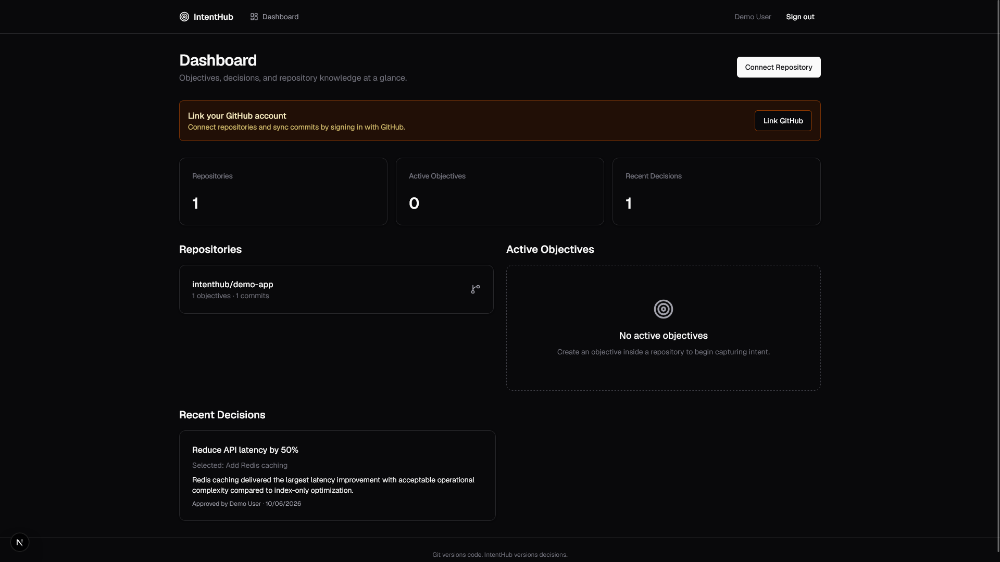
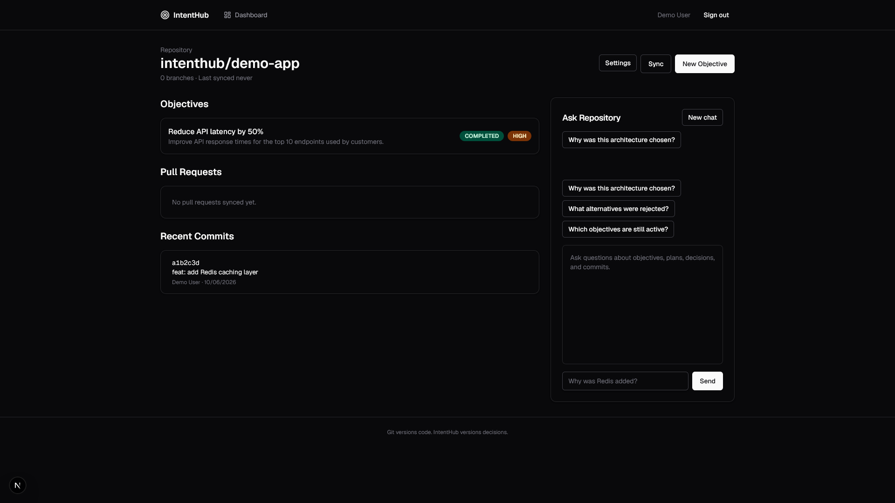
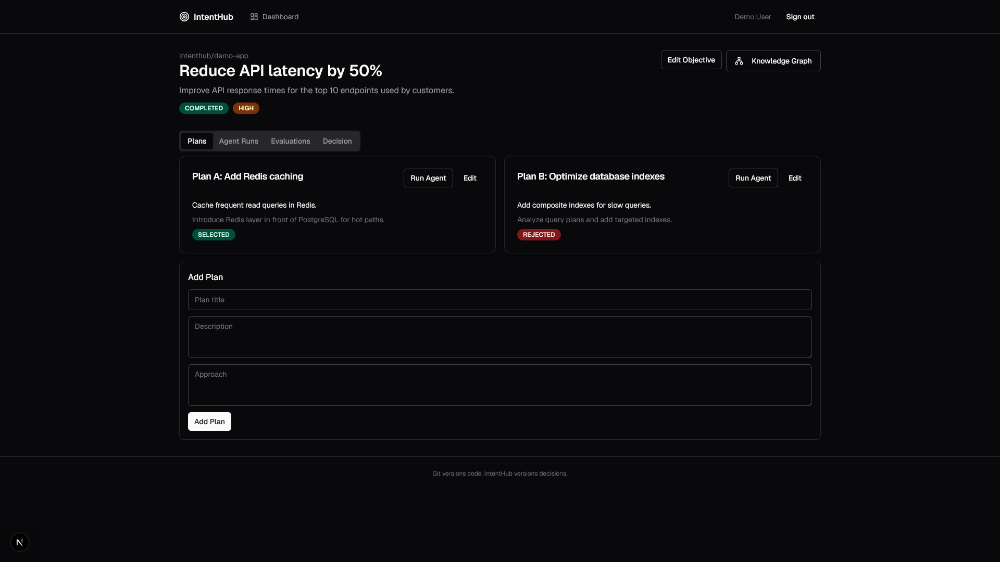
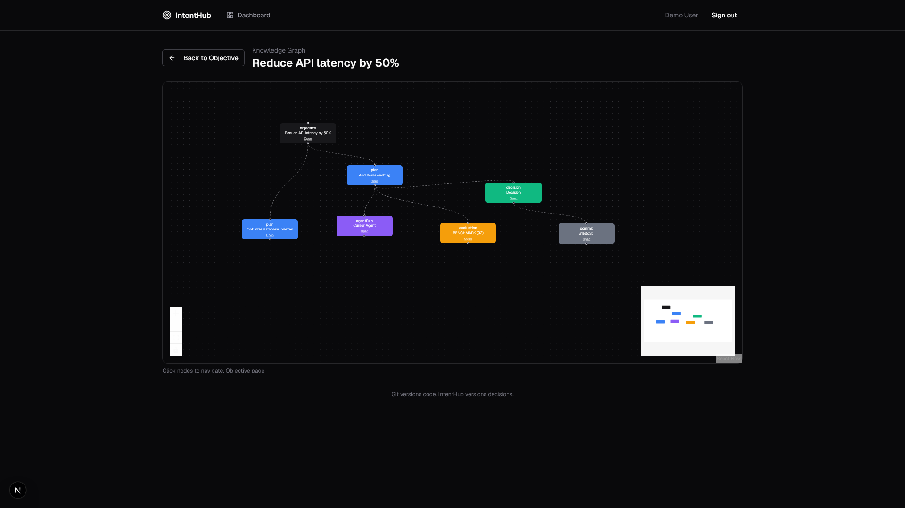
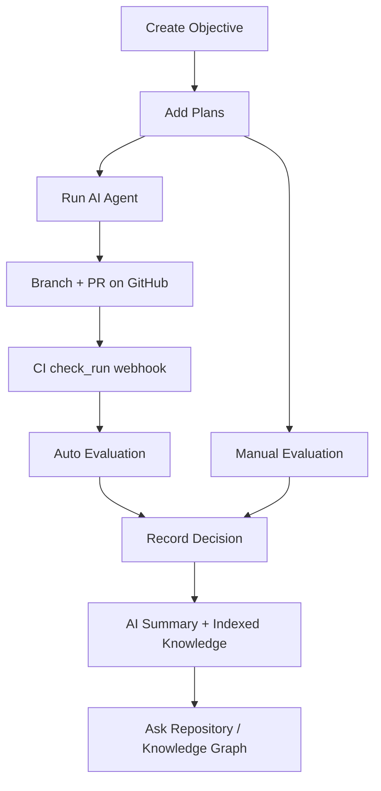

<p align="center">
  <strong>IntentHub</strong>
</p>

<p align="center">
  Git versions code. IntentHub versions decisions.
</p>

<p align="center">
  An AI-native collaboration layer on top of Git — preserving objectives, plans, agent runs,<br />
  evaluations, and decision records linked to commits and searchable over time.
</p>

<p align="center">
  <a href="#quick-start"><strong>Quick start</strong></a> ·
  <a href="#product-tour"><strong>Screenshots</strong></a> ·
  <a href="#local-setup"><strong>Local setup</strong></a> ·
  <a href="#deploy-to-vercel"><strong>Deploy</strong></a> ·
  <a href="docs/production-deploy.md"><strong>Production guide</strong></a>
</p>

<p align="center">
  
  
  
  
  
  
</p>

<p align="center">
  
</p>

---

## Table of contents

- [Why IntentHub](#why-intenthub)
- [Product tour](#product-tour)
- [How it works](#how-it-works)
- [Features](#features)
- [Quick start](#quick-start)
- [Local setup](#local-setup)
- [GitHub OAuth & webhooks](#github-oauth--webhooks)
- [Deploy to Vercel](#deploy-to-vercel)
- [Routes](#routes)
- [API reference](#api-reference)
- [Background jobs](#background-jobs)
- [Development](#development)

---

## Why IntentHub

Traditional Git workflows lose context. A feature ships, the PR merges, and the reasoning behind it — rejected alternatives, benchmarks, tradeoffs — disappears.

IntentHub keeps that knowledge attached to your repository:

| Git stores | IntentHub stores |
|------------|------------------|
| Code, branches, commits | Objectives and priorities |
| Pull requests | Plans and rejected approaches |
| CI results | Evaluations and scores |
| Merge history | Decision records with rationale |

Every completed objective leaves a traceable path from **intent → plan → agent run → evaluation → decision → commit**.

---

## Product tour

### Dashboard

Your home base for connected repositories, active objectives, and recent decisions. Connect GitHub, create objectives, and see what changed across the org at a glance.

<p align="center">
  
</p>

---

### Repository

Each connected repo shows objectives, synced pull requests, and recent commits with semantic insights. The **Ask Repository** sidebar is a hybrid RAG chat — ask *why Redis was added* or *which alternatives were rejected* and get answers grounded in your decision history.

<p align="center">
  
</p>

---

### Objective

Objectives are the core unit of work. Attach multiple plans, run AI agents against them, record evaluations, and capture the final decision with rationale. Status and priority keep work visible from draft through completion.

<p align="center">
  
</p>

---

### Knowledge graph

Navigate the full decision chain interactively — objective, plans, agent runs, evaluations, decision, and linked commit — in a single visual graph.

<p align="center">
  
</p>

---

## How it works



1. **Connect** a GitHub repository — commits, branches, and PRs sync automatically.
2. **Define** an objective and add competing implementation plans.
3. **Execute** an agent on a plan — it reads the repo, applies edits, opens a PR.
4. **Evaluate** via manual entry or CI `check_run` webhooks on agent branches.
5. **Decide** which plan wins and why — IntentHub generates a summary and indexes everything for search.

---

## Features

### Git integration
- Connect GitHub repos with OAuth
- Sync commits, branches, and pull requests
- Auto-register webhooks (`push`, `create`, `delete`, `pull_request`, `check_run`)
- Semantic commit insights — intent, architecture impact, test status

### Decision workflow
- Objectives with status and priority
- Multiple plans per objective (selected / rejected)
- Decision records with rationale and linked commit
- Interactive knowledge graph per objective

### AI capabilities
- **Ask Repository** — hybrid RAG (vector + full-text) with persistent chat sessions
- **Agent runs** — execute on a plan; creates branch, file edits, report, and PR
- **Objective summaries** — generated when a decision is recorded
- **CI-linked evaluations** — `check_run` webhooks on agent branches create test evaluations automatically

### Platform
- Email/password + GitHub OAuth authentication
- Demo mode — browse the full UI without a database
- Background jobs via Trigger.dev (sync, indexing, webhooks, agents)
- Production-ready: Sentry, Upstash rate limiting, health checks

---

## Quick start

Try IntentHub in under a minute — no Docker, database, or auth required:

```bash
git clone https://github.com/lazydevl0per/IntentHub.git
cd IntentHub
npm install
npm run dev:demo
```

Open [http://localhost:3000](http://localhost:3000). Sample data is pre-loaded; write actions (connect repo, sync, forms, chat send) are disabled.

| Route | What to explore |
|-------|-----------------|
| `/` | Dashboard — repos, objectives, recent decisions |
| `/repositories/demo-repo` | Objectives, commits with insights, RAG chat |
| `/repositories/demo-repo/settings` | Sync, webhook, branches, agent config |
| `/objectives/seed-objective-1` | Completed objective with plans, runs, evaluation, decision |
| `/knowledge-graph/seed-objective-1` | Interactive knowledge graph |

For full functionality, continue to [Local setup](#local-setup).

<details>
<summary><strong>Deploy a public read-only demo on Vercel</strong></summary>

1. Create a Vercel project from this repository
2. Set `DEMO_MODE=true` and `NEXT_PUBLIC_DEMO_MODE=true`
3. Set `AUTH_SECRET` to any random string and `NEXT_PUBLIC_APP_URL` to your Vercel URL
4. Use the build command from `vercel.json` (`prisma generate && next build`)
5. Open the deployed URL — sample data loads from fixtures with write actions disabled

</details>

---

## Local setup

### Prerequisites

- Node.js 20+
- Docker (for local PostgreSQL)
- GitHub OAuth app (for repo connection)
- AI API key — [Google AI Studio](https://aistudio.google.com/) (free tier, recommended) or OpenAI
- Trigger.dev account (recommended for background jobs)

### 1. Start PostgreSQL

```bash
docker compose up -d
```

Uses `pgvector/pgvector:pg16` on port 5432.

### 2. Configure environment

```bash
cp .env.example .env
```

| Variable | Required | Description |
|----------|----------|-------------|
| `DATABASE_URL` | Yes | PostgreSQL connection string |
| `AUTH_SECRET` | Yes | Session secret (`openssl rand -base64 32`) |
| `GITHUB_ID` / `GITHUB_SECRET` | For GitHub | OAuth app credentials |
| `GOOGLE_AI_API_KEY` | For AI (Gemini) | Free-tier option from Google AI Studio; embeddings + chat |
| `OPENAI_API_KEY` | For AI (OpenAI) | Embeddings, chat, summaries, commit insights, agents |
| `NEXT_PUBLIC_APP_URL` | Yes | App URL (e.g. `http://localhost:3000`) — used for webhook registration |
| `TRIGGER_SECRET_KEY` | Optional | Trigger.dev secret key; without it, jobs run inline |
| `TRIGGER_PROJECT_REF` | Optional | Trigger.dev project ref |
| `AI_PROVIDER` | Optional | `google` (default in `.env.example`), `openai`, or `anthropic` |
| `AI_CHAT_MODEL` | Optional | Chat model (default `gemini-2.0-flash` with Google, `gpt-4o-mini` with OpenAI) |
| `AI_EMBEDDING_MODEL` | Optional | Embedding model (default `gemini-embedding-001` or `text-embedding-3-small`) |
| `ANTHROPIC_API_KEY` | If using Anthropic | Required when `AI_PROVIDER=anthropic` (OpenAI still needed for embeddings) |
| `GITHUB_WEBHOOK_SECRET` | Optional | Fallback webhook secret if per-repo secret is unset |
| `GITHUB_SYNC_COMMIT_LIMIT` | Optional | Max commits per sync (default `500`) |
| `GITHUB_SYNC_BRANCH_LIMIT` | Optional | Max branches per sync (default `100`) |
| `UPSTASH_REDIS_REST_URL` / `UPSTASH_REDIS_REST_TOKEN` | Optional | Distributed rate limiting for chat and agent endpoints |
| `SENTRY_DSN` | Optional | Error tracking (client + server) |
| `HEALTH_CHECK_TOKEN` | Optional | Bearer token for detailed `/api/health` and `npm run verify:production` in production |

**Free tier (Google Gemini)** — set in `.env`:

```env
AI_PROVIDER=google
GOOGLE_AI_API_KEY=<your-key-from-aistudio.google.com>
AI_CHAT_MODEL=gemini-2.0-flash
AI_EMBEDDING_MODEL=gemini-embedding-001
```

If you switch embedding providers on an existing database, reindex each repository (**Reindex search** on repository settings) so vector search uses consistent embeddings.

### 3. Install and migrate

```bash
npm install
npm run db:migrate
npm run db:seed
```

### 4. Run dev servers

**Terminal 1 — Next.js**

```bash
npm run dev
```

**Terminal 2 — Trigger.dev** (recommended for sync, indexing, webhooks, AI jobs)

```bash
npx trigger.dev@latest login
npm run dev:trigger
```

Open [http://localhost:3000](http://localhost:3000).

> **Demo account** after seeding: `demo@intenthub.dev` / `password123`  
> Link GitHub via OAuth to connect repositories and run agents (branch creation requires a linked GitHub account).

---

## GitHub OAuth & webhooks

### OAuth app

1. Create a [GitHub OAuth App](https://github.com/settings/developers)
2. Set callback URL to `http://localhost:3000/api/auth/callback/github` (or your production URL)
3. Request scopes: `read:user`, `user:email`, `repo`

### Webhooks

When you connect a repository, IntentHub automatically registers a webhook:

```
POST /api/webhooks/github
```

| Event | Purpose |
|-------|---------|
| `push` | Sync commits and index for search |
| `create` / `delete` | Sync branches |
| `pull_request` | Keep the repository PR list in sync |
| `check_run` | Create test evaluations for agent branches when CI completes |

Check webhook status on the repository **Settings** page. If auto-registration fails, verify `NEXT_PUBLIC_APP_URL` is correct.

For local development without a public URL, use [smee.io](https://smee.io) or ngrok to tunnel webhooks, or rely on manual **Sync** from the repository page.

---

## Deploy to Vercel

1. Push to GitHub and import the project in Vercel
2. Add environment variables from `.env.example`
3. Use [Neon](https://neon.tech) PostgreSQL with `pgvector` enabled:
   - Copy the connection string to `DATABASE_URL`
   - In the Neon SQL editor: `CREATE EXTENSION IF NOT EXISTS vector;`
   - Run migrations: `npx prisma migrate deploy`
4. Set `NEXT_PUBLIC_APP_URL` to your production URL
5. Update the GitHub OAuth callback to `https://<your-domain>/api/auth/callback/github`
6. Verify health: `GET /api/health` — expect `{ status: "ok", db: "connected" }`. For the `services` block in production, send `Authorization: Bearer <HEALTH_CHECK_TOKEN>`
7. Deploy Trigger.dev tasks: `npm run deploy:trigger`
8. Connect a repository, create an objective, and trigger **Reindex search** on the repository settings page
9. Confirm GitHub webhooks arrive at `/api/webhooks/github` after a push

See [docs/production-deploy.md](docs/production-deploy.md) for the full provisioning checklist and [docs/internal-runbook.md](docs/internal-runbook.md) for operations.

### Production verification

| Check | How |
|-------|-----|
| Database | `GET /api/health` returns `db: "connected"` |
| Background jobs | `services.trigger: true` in detailed health response (`Authorization: Bearer <HEALTH_CHECK_TOKEN>`) |
| AI features | `services.aiConfigured: true` in detailed health response (`google` or `openai` key set per `AI_PROVIDER`) |
| GitHub OAuth | Sign in with GitHub and connect a repository |
| Search index | Use **Reindex search** on repository settings after connecting |
| Webhooks | Push a commit; repository sync updates without manual sync |

```bash
NEXT_PUBLIC_APP_URL=https://your-app.vercel.app npm run verify:production
```

---

## Routes

| Route | Description |
|-------|-------------|
| `/login`, `/register` | Authentication |
| `/` | Dashboard — repos, active objectives, recent decisions |
| `/repositories/[id]` | Objectives, pull requests, commits with semantic insights, RAG chat |
| `/repositories/[id]/settings` | Sync, webhook status, branches, agent prompt, disconnect |
| `/objectives/[id]` | Plans, agent runs, evaluations, decision, AI summary |
| `/knowledge-graph/[objectiveId]` | Interactive knowledge graph |

---

## API reference

<details>
<summary><strong>Auth</strong></summary>

| Method | Endpoint | Description |
|--------|----------|-------------|
| `POST` | `/api/auth/register` | Email/password registration |
| `POST` | `/api/auth/verify-email/send` | Issue verification token (mail delivery not configured) |
| `GET` | `/api/auth/verify-email/confirm?token=` | Confirm email address |

</details>

<details>
<summary><strong>Repositories</strong></summary>

| Method | Endpoint | Description |
|--------|----------|-------------|
| `GET` | `/api/repositories` | List connected repositories |
| `POST` | `/api/repositories` | Connect a repository (sync + webhook registration) |
| `GET` | `/api/repositories/github` | List GitHub repos for the authenticated user |
| `GET` | `/api/repositories/[id]` | Repository detail |
| `PATCH` | `/api/repositories/[id]` | Update settings (e.g. agent system prompt) |
| `DELETE` | `/api/repositories/[id]` | Disconnect or leave repository |
| `POST` | `/api/repositories/[id]/sync` | Manual sync (queued via Trigger.dev when configured) |
| `POST` | `/api/repositories/[id]/reindex` | Rebuild search indexes for the repository |
| `GET` / `POST` | `/api/repositories/[id]/objectives` | List/create objectives |
| `GET` / `POST` | `/api/repositories/[id]/chat` | List chat sessions / send message (streamed) |
| `GET` | `/api/repositories/[id]/chat/sessions/[sessionId]` | Load chat session messages |
| `GET` / `POST` | `/api/repositories/[id]/invites` | List or create repository invites (owners only) |

</details>

<details>
<summary><strong>Objectives</strong></summary>

| Method | Endpoint | Description |
|--------|----------|-------------|
| `GET` / `PATCH` / `DELETE` | `/api/objectives/[id]` | Objective detail, update, delete |
| `POST` | `/api/objectives/[id]/plans` | Create plan |
| `PATCH` / `DELETE` | `/api/plans/[id]` | Update/delete plan |
| `POST` | `/api/objectives/[id]/agent-runs` | Manually record an agent run |
| `POST` | `/api/objectives/[id]/agent-runs/execute` | Run AI agent on a plan (branch + PR + report) |
| `GET` | `/api/agent-runs/[id]` | Agent run status |
| `POST` | `/api/objectives/[id]/evaluations` | Record evaluation |
| `POST` | `/api/objectives/[id]/decision` | Record decision (triggers objective summary) |
| `GET` | `/api/objectives/[id]/graph` | Knowledge graph data |

</details>

<details>
<summary><strong>System</strong></summary>

| Method | Endpoint | Description |
|--------|----------|-------------|
| `GET` | `/api/health` | Liveness check; includes `services` when authorized (see `HEALTH_CHECK_TOKEN`) |
| `POST` | `/api/webhooks/github` | GitHub webhook handler |

</details>

---

## Background jobs

When `TRIGGER_SECRET_KEY` is set, these run asynchronously via Trigger.dev:

| Job | Trigger |
|-----|---------|
| `sync-repository` | Repo connect, manual sync |
| `index-entity` | Entity create/update |
| `github-webhook` | GitHub push, branch, pull request, and check_run events |
| `analyze-commit` | After commit indexing |
| `generate-objective-summary` | After decision recorded |
| `execute-agent-run` | Agent execution requested |
| `reindex-repository` | Manual reindex from repository settings |

Without Trigger.dev, the same work runs inline in the API process (fine for local testing, not ideal for production).

---

## Development

```bash
npm run lint        # ESLint
npm run typecheck   # TypeScript
npm test            # Unit and integration tests
```

CI (`.github/workflows/ci.yml`) runs lint, typecheck, Prisma migrate deploy, tests, and build on push/PR to `main` or `master`.

### Stack

| Layer | Technology |
|-------|------------|
| Frontend | Next.js 15, TypeScript, Tailwind CSS, shadcn/ui-style components |
| Database | PostgreSQL, Prisma, pgvector |
| Auth | NextAuth (credentials + GitHub OAuth) |
| AI | Google Gemini or OpenAI (embeddings + chat), optional Anthropic for chat |
| Git | GitHub API + webhooks |
| Jobs | Trigger.dev |

---

<p align="center">
  <sub>Git versions code. IntentHub versions decisions.</sub>
</p>
